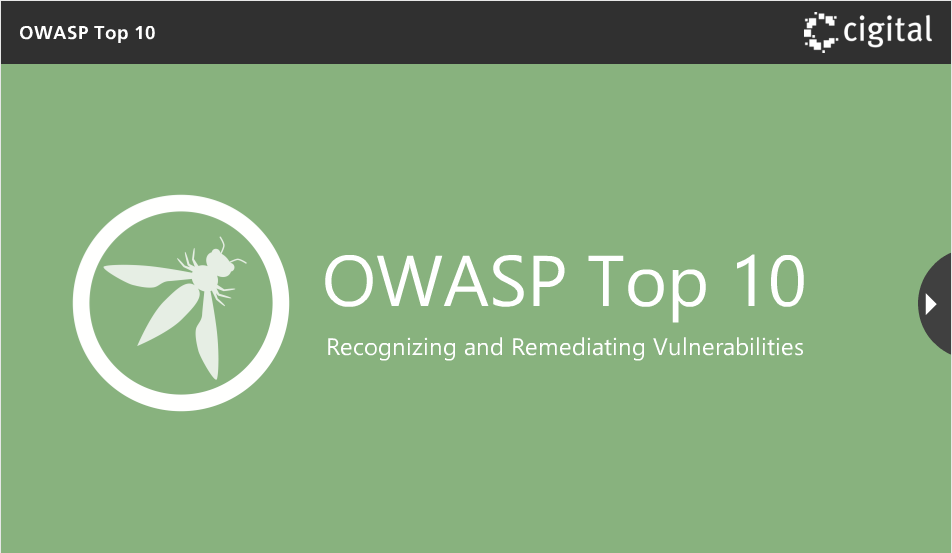
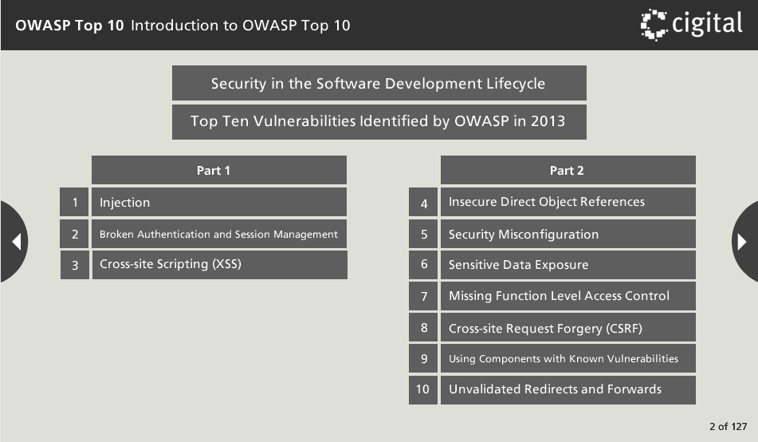
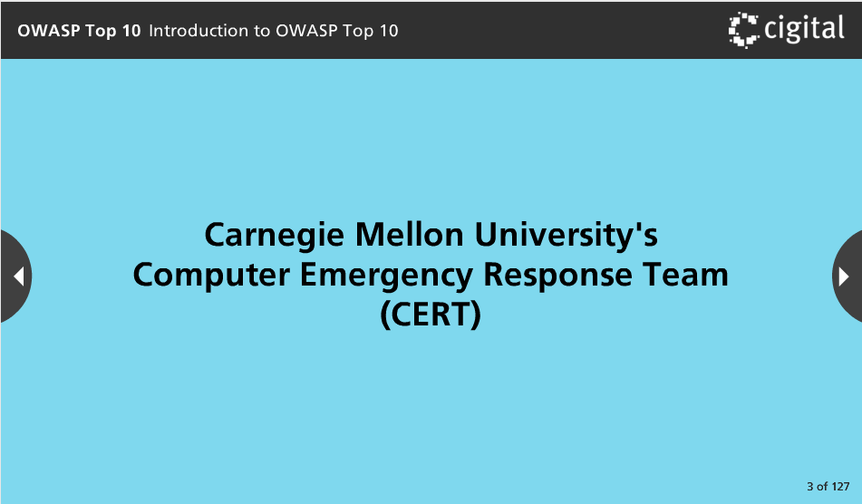
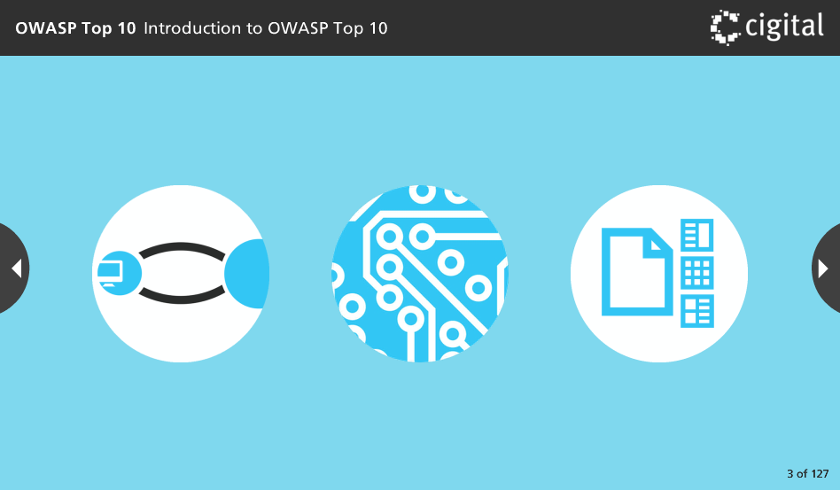
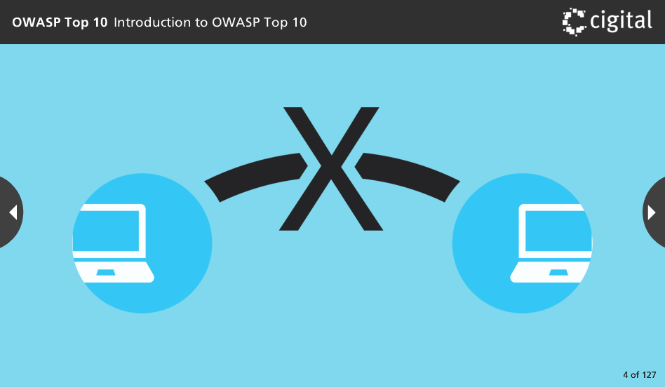
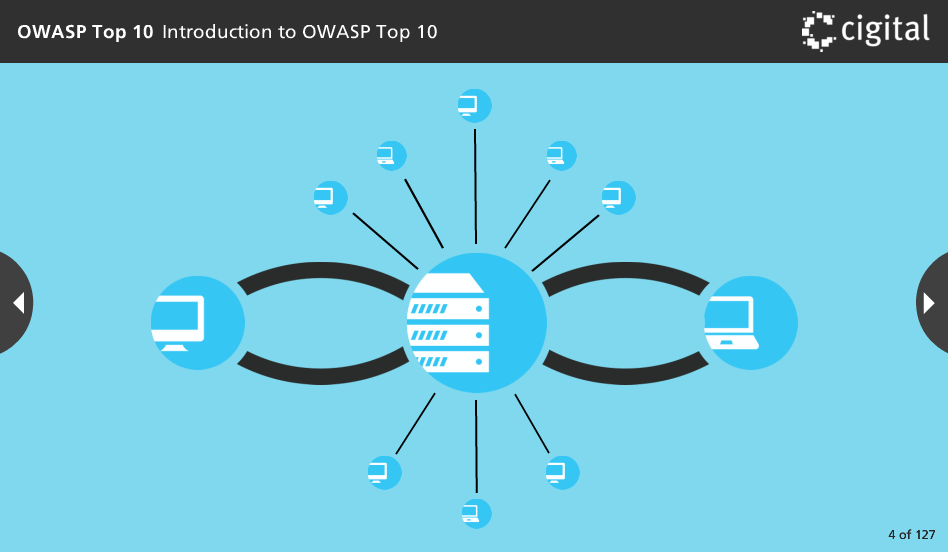
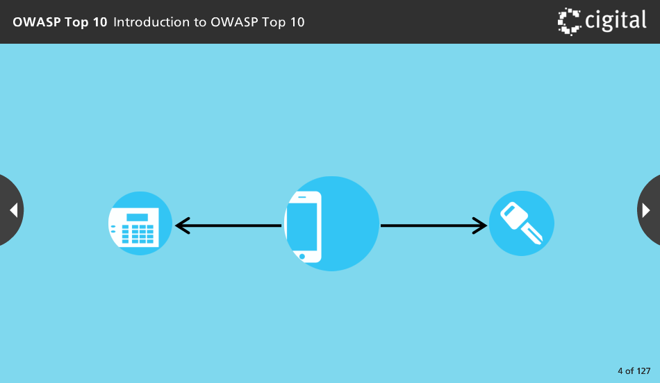
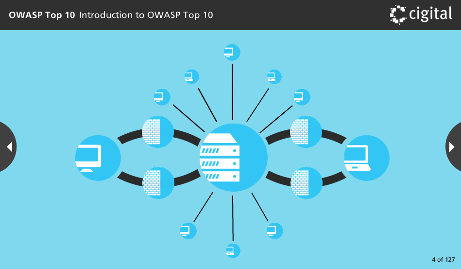
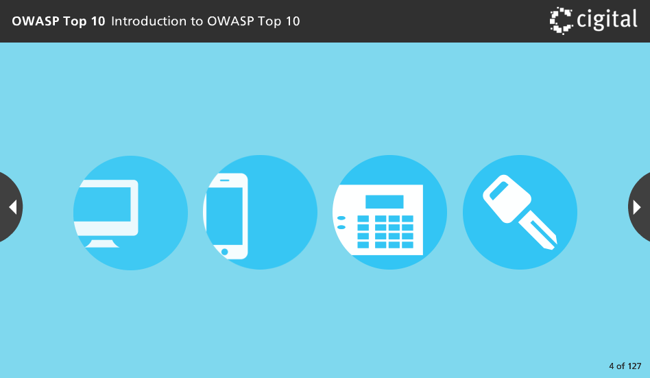

Welcome to the OWASP Top 10, Recognizing and Remediating Vulnerabilities course.

First, we’ll introduce security in the software development lifecycle. Then we’ll explore the top ten vulnerabilities identified by the Open Web Application Security Project (OWASP), a worldwide organization focused on improving the security of application software. This part of the training module includes the top three vulnerabilities. Part two includes the remaining vulnerabilities.

As we look at each of these vulnerabilities, we will identify how exploitations occur and ways to test for the vulnerabilities. We will also explore mitigations, remediation, real world attack examples, and additional learning resources.

According to the computer emergency response team at Carnegie Mellon University more and more software vulnerabilities are being uncovered each year.

Do you know why software security is so difficult? There are three major factors that are considered the trinity of trouble. These are connectivity, complexity, and extensibility.

The world is becoming one big network and we are placing more and more important assets on this network. Not many years ago, computers were largely isolated and could not communicate with each other.

Now everything is connected. Your desktop or laptop computer is no longer just a computer. It is a node in an international system of computers.

There is a good chance that your cell phone can connect to your home security system or even remotely start your car.

Meanwhile, the natural barriers that protected you from actions elsewhere are disappearing and being replaced by artificial barriers like firewalls. And the types of computers in this network are multiplying.

Yesterday it was personal computers and cell phones. Today it is home appliances and automobiles. What will tomorrow add to the network?  When computers are so intimately connected, the problems of securing data and functionality are increasingly magnified
